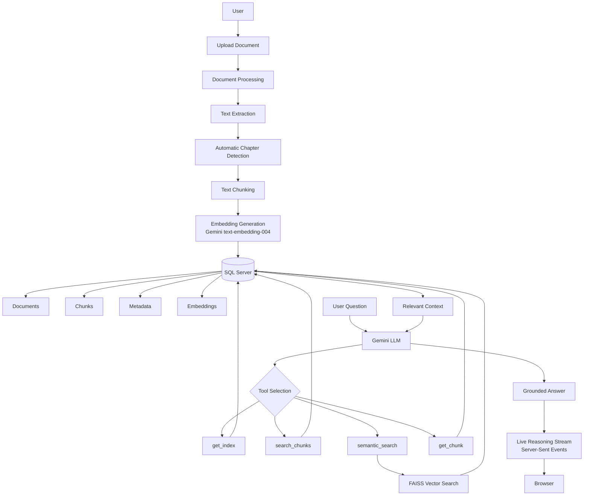
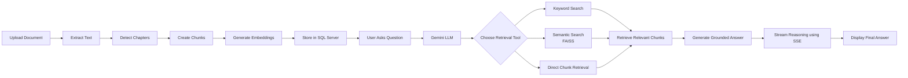
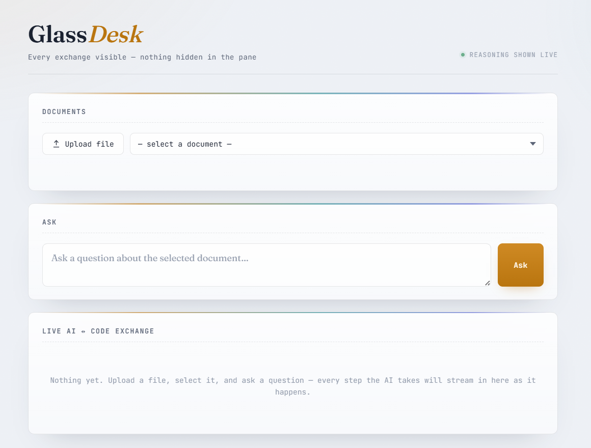

# GlassDesk

### Transparent Retrieval-Augmented Generation (RAG) System for Intelligent Document Question Answering

Most document question-answering systems only display the final answer, hiding the reasoning process that produced it. This makes it difficult to understand how information was retrieved, verify the accuracy of responses, or debug incorrect outputs.

**GlassDesk** is a transparent Retrieval-Augmented Generation (RAG) application that makes the entire retrieval pipeline visible. Instead of behaving like a black box, it streams every interaction between the language model and the retrieval system in real time.

Users can observe how the AI:

* Inspects the document structure
* Selects retrieval tools
* Performs keyword and semantic search
* Retrieves relevant document chunks
* Generates grounded responses using only retrieved context

By exposing every retrieval step, GlassDesk makes AI-powered document question answering easier to understand, debug, and trust.

---

# Why GlassDesk?

Most document chatbots only display the final response, leaving users unaware of how the answer was generated. This lack of transparency makes it difficult to verify retrieved information, troubleshoot incorrect answers, or understand the retrieval process.

GlassDesk addresses this problem by exposing every interaction between the language model and the retrieval engine. Instead of hiding the internal workflow, the application visualizes the complete reasoning pipeline in real time.

### Traditional Document Chatbots

* Operate as black boxes
* Hide retrieval operations
* Make debugging difficult
* Provide little visibility into retrieved context
* Offer limited transparency

### GlassDesk

* Streams AI reasoning in real time
* Displays every tool invocation
* Shows retrieved document chunks
* Supports both keyword and semantic retrieval
* Makes the complete RAG pipeline transparent and explainable

---

# Features

## 📄 Intelligent Document Processing

* Upload PDF, DOCX, PPTX, XLSX, CSV, TXT, and other text-based documents
* Automatic chapter detection for structured documents
* Automatic text extraction and chunk generation
* Background document processing with live progress updates

## 🧠 Retrieval-Augmented Generation

* Keyword-based document retrieval
* FAISS-powered semantic search
* SQL Server document storage
* Gemini tool-calling workflow
* Multi-step document retrieval
* Automatic context selection for answer generation

## 🔍 Transparent AI Reasoning

* Live visualization of every reasoning step
* Displays tool calls made by the language model
* Shows retrieved document chunks before answer generation
* Makes AI decisions easy to inspect and debug

## ⚡ User Experience

* Real-time streaming responses using Server-Sent Events (SSE)
* Modern glassmorphism user interface
* Upload progress tracking
* Multiple document management
* Interactive reasoning feed

---
# 🏗️ System Architecture



## Architecture Overview

GlassDesk follows a Retrieval-Augmented Generation (RAG) architecture designed around transparency and explainability.

Instead of sending the entire document to the language model, uploaded documents are processed into structured chunks, embedded using Gemini's embedding model, and stored in SQL Server. During question answering, Gemini dynamically selects retrieval tools to locate only the relevant document chunks using keyword search, semantic search (FAISS), or direct chunk retrieval.

The retrieved context is then used to generate a grounded response, while every interaction between the language model and the retrieval system is streamed live to the user interface using Server-Sent Events (SSE). This approach improves transparency, reduces hallucinations, and makes the complete retrieval pipeline observable.


---

# 🔄 Project Workflow



## Workflow Explanation

### 1. Document Upload
The user uploads a supported document through the web interface.

### 2. Document Processing
The application extracts text, automatically detects chapter boundaries (where applicable), and divides the document into manageable chunks.

### 3. Embedding Generation
Each chunk is converted into a vector embedding using Google's `text-embedding-004` model.

### 4. Storage
The extracted text, metadata, embeddings, and chapter information are stored in Microsoft SQL Server.

### 5. User Query
The user selects a document and asks a natural language question.

### 6. Intelligent Retrieval
Gemini analyzes the question and dynamically selects the most appropriate retrieval tool:
- `get_index`
- `get_chapter_chunks`
- `search_chunks`
- `semantic_search`
- `get_chunk`

### 7. Context Retrieval
Relevant document chunks are retrieved using keyword search, semantic search (FAISS), or direct chunk lookup.

### 8. Response Generation
The retrieved context is supplied to Gemini, which generates a grounded response based only on the retrieved information.

### 9. Live Transparency
Every reasoning step, tool invocation, retrieved chunk, and final response is streamed to the browser in real time using Server-Sent Events (SSE).


---


# 🛠️ Technology Stack

| Category | Technology |
|------------|------------|
| Programming Language | Python |
| Backend Framework | Flask |
| Frontend | HTML, CSS, JavaScript |
| Database | Microsoft SQL Server |
| AI Model | Google Gemini 1.5 Flash |
| Embedding Model | Gemini text-embedding-004 |
| Vector Search | FAISS |
| Database Driver | pyodbc |
| PDF Processing | PyPDF |
| DOCX Processing | python-docx |
| PPT Processing | python-pptx |
| Excel Processing | openpyxl |
| Environment Variables | python-dotenv |
| Communication | Server-Sent Events (SSE) |
| AI SDK | google-generativeai |


---


# 📂 Folder Structure

```text
GlassDesk/
│
├── static/
│   ├── app.js
│   └── style.css
│
├── templates/
│   └── index.html
│
├── app.py
├── schema.sql
├── requirements.txt
├── README.md
└── .env.example
```

### Folder Description

| File / Folder | Description |
|---------------|-------------|
| `app.py` | Main Flask application containing document processing, RAG pipeline, API endpoints, retrieval logic, and AI orchestration. |
| `templates/` | HTML templates rendered by Flask. |
| `static/` | Frontend assets including CSS and JavaScript. |
| `schema.sql` | SQL Server database schema. |
| `requirements.txt` | Python dependencies. |
| `README.md` | Project documentation. |
| `.env.example` | Environment variable template. |


---


# ⚙️ Installation

## 1. Clone the Repository

```bash
git clone https://github.com/CheshtaSharma/GlassDesk.git

cd GlassDesk
```

---

## 2. Create a Virtual Environment

### Windows

```bash
python -m venv venv

venv\Scripts\activate
```

### Linux / macOS

```bash
python3 -m venv venv

source venv/bin/activate
```

---

## 3. Install Dependencies

```bash
pip install -r requirements.txt
```

---

## 4. Configure Environment Variables

Create a `.env` file.

```env
GEMINI_API_KEY=

FLASK_SECRET_KEY=

SQL_SERVER=

SQL_DATABASE=

SQL_DRIVER=ODBC Driver 17 for SQL Server

SQL_USERNAME=

SQL_PASSWORD=
```

---

## 5. Create Database

Run

```
schema.sql
```

inside SQL Server Management Studio (SSMS).

---

## 6. Run the Application

```bash
python app.py
```

Open

```
http://localhost:5000
```


---


# 💻 Usage

### Upload a Document

- Upload a supported document.
- Wait for document processing to complete.
- Select the uploaded document.

### Ask Questions

- Enter a natural language question.
- Watch the AI reasoning pipeline execute.
- Observe every retrieval step in real time.
- Receive a grounded answer based only on retrieved document chunks.


---


# 📸 Screenshots

## 🏠 Home Page



## 📄 Document Upload

Upload and process documents with automatic chapter detection and chunk generation.


## 📚 Document Management

View and manage uploaded documents.


## ❓ Asking Questions

Ask natural language questions about uploaded documents.


## 🧠 Transparent AI Reasoning

Every retrieval step is streamed live so users can observe how the answer is generated.


## ✅ Final Answer

Grounded responses generated only from retrieved document chunks.


---


# 🎥 Demo

A complete walkthrough of GlassDesk, including document upload, intelligent retrieval, live reasoning, and grounded response generation.

> ** A demo video will be added soon.**


---


# 📊 Project Highlights

- 📄 Supports multiple document formats (PDF, DOCX, PPTX, TXT, CSV, XLSX)
- 🧠 Retrieval-Augmented Generation (RAG)
- 🔍 FAISS-powered Semantic Search
- 🗄️ SQL Server Document Storage
- ⚡ Background Document Processing
- 🤖 Gemini Tool Calling
- 📡 Live Reasoning Streaming using Server-Sent Events (SSE)
- 📚 Automatic Chapter Detection
- 📑 Intelligent Document Chunking
- 🔎 Keyword + Semantic Retrieval


---


# 📈 Future Improvements

- Docker support for simplified deployment
- User authentication and authorization
- OCR support for scanned documents
- Cloud storage integration
- Hybrid retrieval using keyword and vector search
- Conversation history
- REST API documentation
- Citation highlighting in generated answers
- Multi-user document management
- Cloud deployment on Azure or AWS


---


# 🎯 Lessons Learned

Developing GlassDesk provided practical experience in building an end-to-end Retrieval-Augmented Generation (RAG) system.

During development, I gained hands-on experience with:

- Designing transparent RAG pipelines
- Implementing semantic search using FAISS
- Working with SQL Server for document storage
- Streaming responses using Server-Sent Events (SSE)
- Optimizing document chunking and retrieval
- Integrating Gemini APIs with tool calling
- Building explainable AI systems instead of black-box applications

The biggest takeaway from this project was understanding that the effectiveness of a RAG system depends not only on the language model, but also on efficient preprocessing, retrieval, and context management.


---


# 📄 License

This project is licensed under the MIT License.


---

